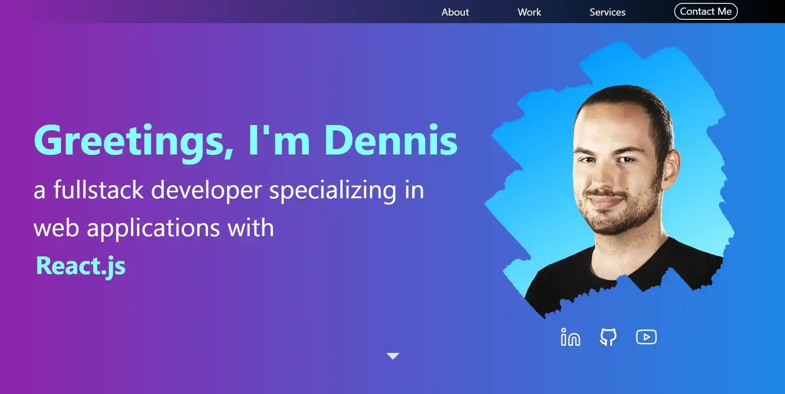
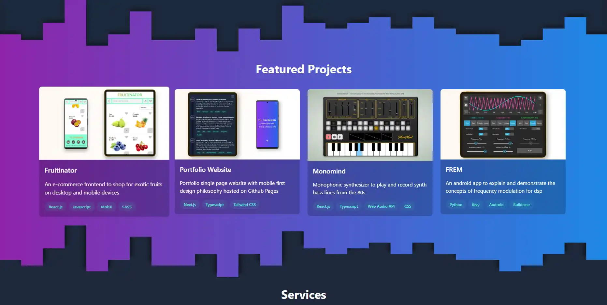
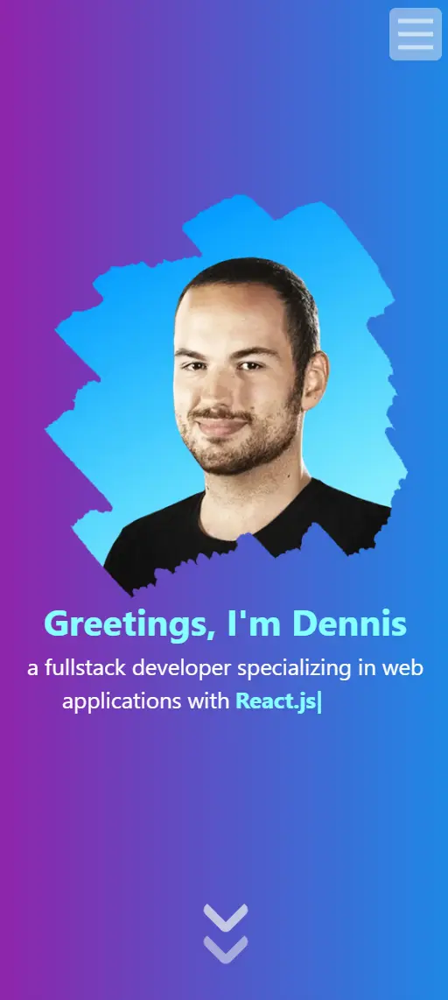
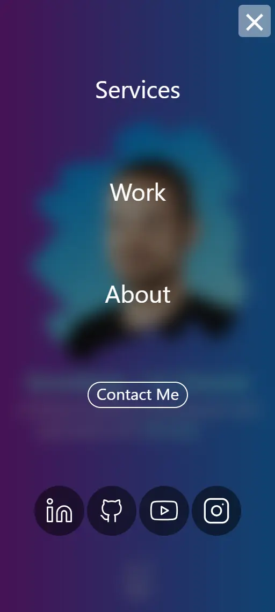
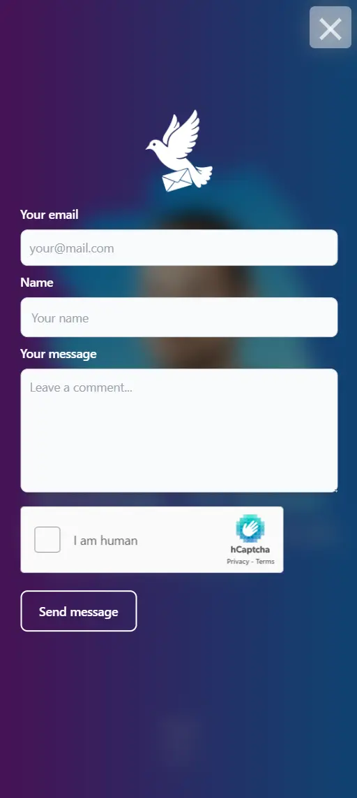

# Portfolio Website

This is a responsive one page portfolio website which highlights skills, work experience, projects and shares some personal information about the owner (Me👋) of the website.

<p align="center">
    
    
</p>
<p align="center">
    
    
</p>
<p align="center">
    
    
    
</p>

## Key features:

<p align="center">
  <a href="https://skillicons.dev">
    
  </a>
</p>

- Built with Next.js, Typescript, Node.js, Tailwind CSS, Framer Motion
- Secure contact Form with hcaptcha using the API routes of Next.js
- Responsive Design, Burger Menu, SEO

## Setup contact form:
- To use hcaptcha you will need to create a free account:
https://www.hcaptcha.com
- create copy of .env_template and rename it to .env in the root directory
- enter secret and sitekey of your hcaptcha account
- if you own a domain, use credentials (email, pwd) and SMTP details of the email belonging to the domain
- enter the email (RECIPIENT) to which the messages should be send (can be a public email like protonmail)
- Please note: for deployment on vercel you have to enter the env variables in their dashboard
```
NEXT_PUBLIC_HCAPTCHA_SECRET=
NEXT_PUBLIC_HCAPTCHA_SITEKEY=
NEXT_PUBLIC_SMTP_SERVER=
NEXT_PUBLIC_SMTP_PORT=
NEXT_PUBLIC_USER=
NEXT_PUBLIC_PWD=
NEXT_PUBLIC_RECIPIENT=
```

## Roadmap
- Internationalisation (I18n)
- Dynamic project section using the Github API


## Check it out:
https://www.fullstacklab.net